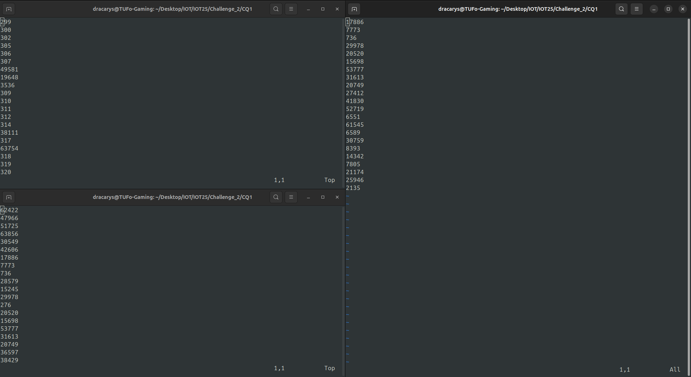

Authors: 
**Kevin Abate:       10812892**
**Lorenzo Pigato: 10766953** **[Team Leader]** 

---
# Project topic
The project consists in **analyzing network traffic** produced by **MQTT** and **CoAP** clients and brokers. Packets have been analyzed using Wireshark, mainly through _thsark_ terminal interface in order to exploit advanced filtering and sorting

---
# Questions
## CQ1
 > How many different Confirmable PUT requests obtained an unsuccessful response from the local CoAP server?

#### Answer: 22

The answer is obtained by filtering all **confirmable PUT requests** and saving their **message id** in order to check if any **error response** has been sent by the server:  

**Filters**
```wireshark
coap.type == 0 && coap.code == 3	     // CONfirmable PUT requests
coap.code >= 128 && ip.src == 127.0.0.1	 // Error rsponse sent from the server
```
 
 **tshark commands**
 ```bash
tshark -r challenge2.pcapng -Y "coap.type == 0 && coap.code == 3" -T fields -e coap.mid > put_requests.txt

tshark -r challenge2.pcapng -Y "coap.code >= 128 && ip.src == 127.0.0.1" -T 
fields -e coap.mid > error_responses.txt

grep -F -f put_requests.txt error_responses.txt | wc -l
 ```

**Final output** [message_id]



<hr style="page-break-after: always;" />

## CQ2
> How many CoAP resources in the coap.me public server received the same number of unique Confirmable and Non Confirmable GET requests?

#### Answer: 3 [large, secret, validate]

In order to solve the problem, it was necessary to find find out the **address** of the **coap.me server** first. This can be done by looking up DNS requests:

```wireshark
dns.qry.name contains "coap" && dns.flags && dns.flags.response == 1 && dns.a	
```

![[Screenshot from 2025-03-31 10-32-17.png]] from these DNS requests it is possible to retrieve the **coap.me ip address**: `134.102.218.18`

Now two different filters have to be used: the first one will return the **NON-confirmable GET requests** directed to the **coap.me server** while the second one retrieves the **CONfirmable** ones. Finally, the outputs of the two previously are compared and matching rows are returned.

**Filters**
```wireshark
coap.type == 0 && coap.code == 1 && ip.dst == 134.102.218.18	// CON GET
coap.type == 1 && coap.code == 1 && ip.dst == 134.102.218.18	// NON GET
```

**tshark commands**
```bash
tshark -r challenge2.pcapng -Y "coap.type == 1 && coap.code == 1 && ip.dst == 134.102.218.18" -T fields -e coap.opt.uri_path -e coap.token | sort | uniq | cut -f1 | sort | uniq -c > con_get_resources_count.txt

tshark -r challenge2.pcapng -Y "coap.type == 0 && coap.code == 1 && ip.dst == 134.102.218.18" -T fields -e coap.opt.uri_path -e coap.token | sort | uniq | cut -f1 | sort | uniq -c > non_get_resources_count.txt

# Find common columns between the two sorted files
comm -12 <(sort con_get_resources_count.txt) <(sort non_get_resources_count.txt)
```

Each _tshark_ command produces a list of sets [resource_path, token] which is then piped through a _sort_ and _uniq_ command in order to find unique couples of resources and tokens. This new list is then cut to keep only the resource and piped again through _sort_ and counted using _uniq -c_ to find how many requests are done for each resource 

**Final output** [requests, topic]
```txt
	1 large
	1 secret
	1 validate
```
---
## CQ3
> How many different MQTT clients subscribe to the public broker HiveMQ using multi-level wildcards?

#### Answer:  4 [38619, 38641, 54449, 57863]

First, a Wireshark filter has been made in order to find out the **address** of the HiveMQ broker from DNS requests:

```wireshark
dns.qry.name == broker.hivemq.com && dns.flags && dns.flags.response == 1 && dns.a
```

![[Screenshot from 2025-03-31 11-09-05.png]]**3 IP addresses** are provided by the DNS when the resolution of `broker.hivemq.com` is requested: `35.158.43.69` , `35.158.34.213`, `18.192.151.104`

Then, MQTT subscribe messages which were sent to these IPs were analyzed to identify topics that contain the **multi-level wildcard**:

```wireshark
(ip.addr == 35.158.43.69 || ip.addr == 35.158.34.213 || ip.addr == 18.192.151.104) && mqtt && mqtt.msgtype == 8 && mqtt.topic contains "#"
```
![[Screenshot from 2025-03-31 11-14-52.png]]The clients **differ** from each other by the **TCP port** they use to make requests

**tshark commands**

```bash
tshark -r challenge2.pcapng -Y "(ip.addr == 35.158.43.69 || ip.addr == 35.158.34.213 || ip.addr == 18.192.151.104) && mqtt && mqtt.msgtype == 8 && mqtt.topic contains \"#\" " -T fields -e ip.src -e tcp.srcport -e mqtt.topic > wildcard_subs.txt

cut -f2 wilcard_subs.txt | sort | uniq -c | wc -l
```

**Final Output** [ip_src, src_port, topic]

 

---
## CQ4 
>How many different MQTT clients specify a last Will Message to be directed to a topic having as first level "university" ?"

#### Answer: 1 [38083 - university/department12/room1/temperature]

A set of filter rules can be used to find all the **MQTT connect** requests, with the **willflag** and  **CONNACK** flags set to 1 and a **Last Will Topic** that contains the string "university"

**Filter**
```wireshark
mqtt.msgtype == 1 && mqtt.conflag.willflag == 1 && mqtt.willtopic contains "university"
```

**Output** [src_port, topic]
![[Pasted image 20250406160819.png]]

<hr style="page-break-after: always;" />

## CQ5
> How many MQTT subscribers receive a last will message derived from a subscription without a wildcard?

#### Answer: 3 [39551, 53557, 41789]

To answer this question, five steps are required:

1 - **Distinct topics** that have a last will message flag set and the clients which set it are collected:

```wireshark
mqtt.conflag.willflag == 1
```
![[Screenshot from 2025-03-31 12-17-51.png]]
**Output**: [src_port, topic]
```txt
	38083	university/department12/room1/temperature
	56285	metaverse/room2/floor4
	53485	hospital/facility3/area3
	42665	metaverse/room2/room2
```

2 - **Filter connection reset packets** to determine if any **connection reset** has been sent by a client that has configured a **Last Will Topic** message:
```wireshark
tcp.flags.reset == 1 && tcp.srcport == {topics.txt}
```

![[Screenshot from 2025-03-31 12-25-48 1.png]]
	**Note**: `xargs` is used in order to provide filter inputs from the _topics.txt_ file

**Output**:[src_port, dst_port]
```
38083	1883
```

4 - **Match Last Will Topic with failing clients**:
![[Screenshot from 2025-03-31 12-34-28.png]]
**Output**: [topic]
```
university/department12/room1/temperature
```

5 - **Retrieve broker's messages destination**: Now that the single interesting topic is known, messages sent by the broker on it can be retrieved, with their destination being the interesting part:

```wireshark
tcp.srcport == 1883 && mqtt.msgtype == 3 && mqtt.topic == university/department12/room1/temperature
```
![[Screenshot from 2025-03-31 12-36-55.png]]
**Output**: [dst_port]
```
	39551
	53557
	51743
	41789
```

6 - **Check subscriptions without wildcards**: With clients' port in hand, subscriptions messages from them to the topic without wildcards can be easily found
```wireshark
mqtt.msgtype == 8 && mqtt.topic == university/department12/room1/temperature
```
![[Screenshot from 2025-03-31 12-43-40.png]]
	**Note**: `grep` is used in order to find common elements between the output found at point 5 and the output of this last filter

<hr style="page-break-after: always;" />

**Final answer**:
```
	39551
	53557
	41789
```

<hr style="page-break-after: always;" />

## CQ6
>How many MQTT publish messages directed to the public broker Mosquitto are sent with the retain option and use QoS “At most once”?
 
#### Answer: 208

To find the address of the Mosquitto broker, DNS requests are filtered
```wireshark
dns.qry.name contains "mosquitto" && dns.flags.response == 1 && dns.a
```
![[Screenshot from 2025-03-31 12-50-31.png]]
	 Mosquitto broker IP is: `5.196.78.28`

It's now possible to analyze the traffic with QoS equals to zero (at most once), sent by the broker with the retain option activated
```wireshark
mqtt.qos == 0 && mqtt.msgtype == 3 && mqtt.retain == 1 && ip.dst ==  5.196.78.28
```
![[Screenshot from 2025-03-31 12-56-12.png]]

Packets are then counted using `wc -l`
![[Screenshot from 2025-03-31 12-47-02.png]]
## CQ7
>How many MQTT-SN messages on port 1885 are sent by the clients to a broker in the local machine?

#### Answer: 0

After changing the port of the MQTT-SN to 1885, filters to find _mqttsn_ packets were applied. No packet is shown, hence there is no _mqttsn_ traffic

```wireshark
mqttsn && tcp.dstport == 1885
```
![[Screenshot from 2025-03-31 13-02-34.png]]


